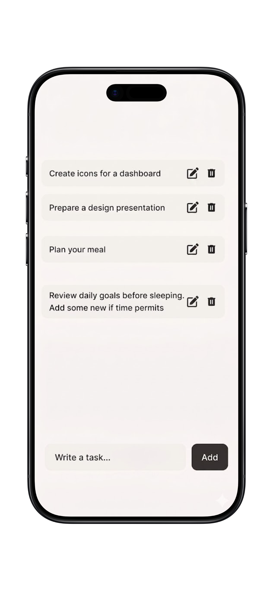

# Task Management App 📝

A clean, modern, and efficient task management application built with **Flutter**. Designed to help users stay organized with a minimalist interface and seamless interactions.

---

## 📸 App Preview

<div align="center">
  
  <h3>✨ Minimalist Task Interface</h3>
</div>

---

## 🚀 Key Features

* **Task Management**: Create, Read, Update, and Delete (CRUD) operations for your daily tasks.
* **Swipe-to-Dismiss**: Integrated **`Dismissible`** widget for an intuitive and fast task removal experience.
* **Edit Functionality**: Easily update tasks via a quick tap or edit icon.
* **Responsive UI**: Modern flat design optimized for mobile screens.
* **State Management**: Robust reactive architecture using **Bloc/Cubit**.

---

## 🛠 Tech Stack

* **Framework**: Flutter
* **Language**: Dart
* **State Management**: Bloc / Cubit
* **UI Interactions**: Dismissible (Swipe-to-Delete)
* **Design**: Minimalist / Clean UI
* **Data Handling**: List-based local management

---

## 💡 How It Works

1.  **Add**: Enter your task in the input field at the bottom and click "Add".
2.  **Edit**: Simply click on the **Edit icon** or the task text to update its content.
3.  **Delete**: **Swipe left** on any task to trigger the `Dismissible` effect and remove it instantly.

---

## ⚙️ How to Run

1. Clone the repository:
```bash
git clone [https://github.com/YOUR_USERNAME/YOUR_REPOSITORY_NAME.git](https://github.com/YOUR_USERNAME/YOUR_REPOSITORY_NAME.git)